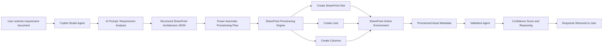
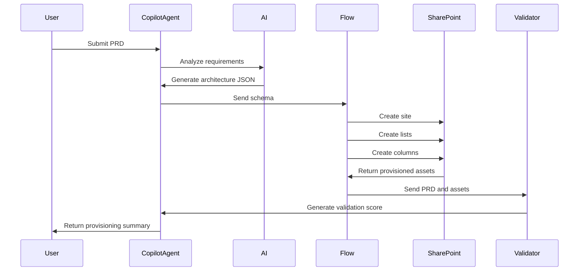

## SPARK – AI SharePoint Solution Accelerator  
*Turn requirement documents into production-ready SharePoint solutions in minutes.*
---

# 1. The Story

Every organization uses **SharePoint** to build internal business solutions.

Examples include:

- Project management portals  
- Risk and compliance trackers  
- Asset management systems  
- Workshop portals  
- Customer onboarding trackers  

However, the journey from **idea → solution** is often slow.

It typically starts with a **requirement document**, spreadsheet, or **Product Requirement Document (PRD)**.

Someone must then translate those requirements into a working SharePoint solution.

This process requires several steps:

1. Understanding the requirement document  
2. Designing the SharePoint architecture  
3. Creating sites and lists  
4. Defining columns and validation rules  
5. Applying governance and structure  

Even for experienced architects, this process can take **several hours or even days**.

## The Reality in Most Organizations

Requirements come in **different formats**:

- Word documents  
- PRDs  
- Emails  
- Meeting notes  
- PowerPoint slides  

Architects must manually interpret these documents and decide:

- What lists are needed  
- What columns should exist  
- What validation rules apply  
- How data relationships should work  

This manual translation introduces several challenges.

### Interpretation Errors

Different people interpret requirements differently.

This can lead to:

- Incorrect list structures  
- Missing columns  
- Inconsistent naming conventions  

### Slow Solution Prototyping

Building even a simple SharePoint prototype requires manual configuration.

This slows down:

- Innovation  
- Experimentation  
- Solution validation
- 
### Lack of Requirement Validation

Even after a solution is built, teams rarely verify whether the implementation **fully matches the original requirements**.

## What If This Process Was Automated?

What if we could simply provide a **requirement document**, and an intelligent system could:

1. Understand the requirements  
2. Design the SharePoint architecture  
3. Automatically provision the solution  
4. Validate that the implementation matches the requirements  

This is the problem **SPARK** solves.

---

# 2. The Solution

**SPARK** is an AI-powered SharePoint solution accelerator that automatically converts **requirement documents into working SharePoint solutions**.

The system combines:

- AI reasoning  
- SharePoint automation  
- Architecture validation  

to transform **PRDs into fully provisioned SharePoint environments**.

Instead of manually designing and building solutions, users simply provide a **requirement document**.

**SPARK handles the rest.**

[Demo video](assets\DemoVideo)

---

# 3. How It Works

The solution uses a **multi-stage AI architecture**.

## Step 1 – Requirement Understanding

A **Copilot Studio agent** analyzes the requirement document and extracts:

- Business entities  
- Processes  
- Fields  
- Validation rules  

## Step 2 – Architecture Design

The AI agent converts the extracted information into a **SharePoint architecture design**, determining:

- Site structure  
- Lists required  
- Columns and metadata  
- Validation rules  

## Step 3 – Automated Provisioning

A **Agent flow** provisions the architecture automatically using **Microsoft Graph APIs**, creating:

- SharePoint sites  
- Lists  
- Columns  

## Step 4 – AI Validation

A validation agent compares:

- The original requirements  
- The generated architecture  
- The provisioned assets  

and produces:

- A confidence score  
- Reasoning  
- Implementation insights  

---

# 4. Solution Architecture

# 5. Process Flow

# 6. Key Capabilities

## AI Requirement Interpretation
Automatically converts **natural language requirement documents** into structured architectures.

## Automated SharePoint Provisioning
Uses **Microsoft Graph APIs** to automatically create:

- Sites  
- Lists  
- Columns  

## Architecture Intelligence
The AI agent applies **SharePoint best practices**, including:

- Scalable list design  
- Logical entity separation  
- Proper data modeling  

## Automated Validation
A validation agent verifies whether the deployed solution **accurately reflects the original requirements**.

---

# 7. Solution Benefits

## Faster Solution Development
SharePoint solutions can be created in **minutes instead of hours**.

## Reduced Human Error
Architecture generation follows **consistent design patterns**.

## Rapid Prototyping
Organizations can quickly test ideas and build **proof-of-concept solutions**.

## AI-Assisted Architecture
The system supports architects by **automating repetitive design tasks**.

## Built-In Governance
The validation agent provides **transparency and confidence** in the deployed solution.

---

# 8. Value to Organizations

SPARK helps organizations unlock more value from SharePoint by enabling:

| Capability | Impact |
|------------|--------|
| Rapid solution creation | Faster business innovation |
| AI-assisted architecture | Reduced design effort |
| Automated provisioning | Improved efficiency |
| Requirement validation | Higher solution quality |

---

# 9. Prerequisites

To deploy the solution, the following components are required.

## Platform

- Microsoft Copilot Studio
- Microsoft 365 tenant 
- SharePoint Online
- Microsoft Azure

## AI and Automation

- Copilot Studio agent  
- Agent Flows  
- Microsoft Graph API  

## Permissions

- SharePoint **Sites.ReadWrite.All** permission  
- Azure App Registration for Graph authentication with the following API permission, **Sites.ReadWrite.All, Sites.Manage.All, Group.ReadWrite.All**.  

# 10. Innovation Highlights

SPARK introduces several innovations.

## PRD-Driven Solution Generation
Requirement documents are transformed directly into **SharePoint solutions**.

## AI-Driven Architecture Design
The AI agent performs **architectural reasoning before provisioning**.

## Multi-Agent Validation
A validation agent evaluates the final solution and provides **confidence scoring**.

## End-to-End Automation
The entire process from **requirements → deployment → validation** is automated.

# 11. Future Enhancements

Potential extensions include:

- Governance policy enforcement  
- Reusable solution templates  
- Architecture optimization recommendations  

## Version history

Version|Date|Author|Comments
-------|----|----|--------
1.0 |March 14, 2026|Shrushti Shah, Bhushan Gawale|AI SharePoint Solution Accelerator

## Disclaimer

**THIS CODE IS PROVIDED *AS IS* WITHOUT WARRANTY OF ANY KIND, EITHER EXPRESS OR IMPLIED, INCLUDING ANY IMPLIED WARRANTIES OF FITNESS FOR A PARTICULAR PURPOSE, MERCHANTABILITY, OR NON-INFRINGEMENT.**

---

## This demo illustrates

# Demo Highlights

This demo shows how **SPARK – AI SharePoint Solution Accelerator** transforms requirement documents into working SharePoint solutions in minutes.

1. The user accesses the SPARK agent from **Microsoft Teams or SharePoint**.

2. The user asks the agent to provision a SharePoint solution.

3. The agent prompts the user to upload a **Product Requirement Document (PRD)**.

4. Once the PRD is provided, the AI analyzes the document and automatically generates a **SharePoint architecture schema**, including:
   - site structure
   - lists
   - columns
   - validation rules

5. The architecture is then sent to an automated provisioning flow that uses **Microsoft Graph APIs** to create:
   - the SharePoint site
   - required lists
   - list columns and metadata 

6. After provisioning, the **AI Validation Engine** evaluates the deployed solution by comparing the original PRD with the generated assets.

7. The agent then returns a **validation confidence score, reasoning, and a summary of the provisioned SharePoint solution**.

In just a few minutes, SPARK demonstrates how organizations can move from **requirement documents to fully provisioned SharePoint solutions using AI-driven automation.**

## Working solution snippet

Find the working snippet of the Copilot Studio *SPARK - AI SharePoint Solution Accelerator* agent here,[Copilot Studio TechnicalS Solution snippet](assets\CopilotStudioSnippet) 

Find the working snippet of the agent flow used in the agent to provision the SharePoint assests here,[Working Agent Flow snippet](assets\AgentFlowSnippet)

Find the detailed snippets of working solution here, [SPARK agent in action snippet](assets\DemoSnippet). 
